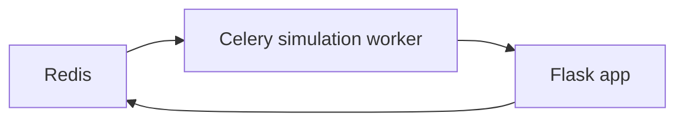

# For developers

Project make use of poetry for dependency management. If you do not have it installed, check official [poetry installation guide](https://python-poetry.org/docs/).
Project is configured to  create virtual environment for you, so you do not need to worry about it.
Virtual environment is created in `.venv` folder in the root of the project.

## Installing dependencies

To install all dependencies, run:

```bash
poetry install
```

This will install all the dependencies including `test` and `docs` ones.
If you want to test app, you do not need `docs` dependencies, you can skip them by using:

```bash
poetry install --without docs
```

If you want to install only main dependencies, you can use:

```bash
poetry  install --only main,test
```
(There can't be space after comma in above command)

## Building and running the app

Application consists of multiple components. Following instruction will guide you through the process of set up and running the application.

Here is a flowchart that shows the various dependencies between the different components of the application.



1. Download SHIELD-HIT12A simulator

    Currently, we store binaries of simulators on S3 filesystem. SHIELD-HIT12A (full version) and Fluka files are encrypted.

    To simply init download process we have to run following commands:

    === "Linux"

        ```bash
        poetry run yaptide/admin/simulators.py download-shieldhit --dir bin
        ```

    === "Windows (PowerShell)"

        ```powershell
        poetry run yaptide\admin\simulators.py download-shieldhit --dir bin
        ```

    To get full instruction of command usage we can type

    === "Linux"

        ```bash
        poetry run yaptide/admin/simulators.py
        ```

    === "Windows (PowerShell)"

        ```powershell
        poetry run yaptide\admin\simulators.py
        ```


2. Get the redis
    If you already use it just start it on port `6379`

    If not good solution would comes with help of docker, run the following commands:

    ```bash
    docker run --detach --publish 6379:6379 --name yaptide_redis redis:7-alpine
    ```

    To remove this container use:

    ```bash
    docker rm -f yaptide_redis
    ```

3. Run Celery simulation-worker

    You can reuse the same terminal, as for redis, as docker sends redis process to the background

    === "Linux"

        ```bash
        PATH=$PATH:bin BACKEND_INTERNAL_URL=http://127.0.0.1:5000 CELERY_BROKER_URL=redis://127.0.0.1:6379/0 CELERY_RESULT_BACKEND=redis://127.0.0.1:6379/0 poetry run celery --app yaptide.celery.simulation_worker worker --events -P eventlet --hostname yaptide-simulation-worker --queues simulations --loglevel=debug
        ```

    === "Windows (PowerShell)"

        ```powershell
        $Env:PATH += ";" + (Join-Path -Path (Get-Location) -ChildPath "bin"); $env:BACKEND_INTERNAL_URL="http://127.0.0.1:5000"; $env:CELERY_BROKER_URL="redis://127.0.0.1:6379/0"; $env:CELERY_RESULT_BACKEND="redis://127.0.0.1:6379/0"; poetry run celery --app yaptide.celery.simulation_worker worker --events -P eventlet --hostname yaptide-simulation-worker --queues simulations --loglevel=debug
        ```


4. Run Celery helper-worker

    === "Linux"

        ```bash
        FLASK_SQLALCHEMY_DATABASE_URI=sqlite:///db.sqlite BACKEND_INTERNAL_URL=http://127.0.0.1:5000 CELERY_BROKER_URL=redis://127.0.0.1:6379/0 CELERY_RESULT_BACKEND=redis://127.0.0.1:6379/0 poetry run celery --app yaptide.utils.helper_worker worker --events --hostname yaptide-helper-worker --queues helper --loglevel=debug
        ```

    === "Windows (PowerShell)"

        ```powershell
        $env:FLASK_SQLALCHEMY_DATABASE_URI="sqlite:///db.sqlite"; $env:BACKEND_INTERNAL_URL="http://127.0.0.1:5000"; $env:CELERY_BROKER_URL="redis://127.0.0.1:6379/0"; $env:CELERY_RESULT_BACKEND="redis://127.0.0.1:6379/0"; poetry run celery --app yaptide.utils.helper_worker worker --events --hostname yaptide-helper-worker --queues helper --loglevel=debug
        ```


5. Run the app

    === "Linux"

        ```bash
        FLASK_USE_CORS=True FLASK_SQLALCHEMY_DATABASE_URI="sqlite:///db.sqlite" CELERY_BROKER_URL=redis://127.0.0.1:6379/0 CELERY_RESULT_BACKEND=redis://127.0.0.1:6379/0 poetry run flask --app yaptide.application run
        ```

    === "Windows (PowerShell)"

        ```powershell
        $env:FLASK_USE_CORS="True"; $env:FLASK_SQLALCHEMY_DATABASE_URI="sqlite:///db.sqlite"; $env:CELERY_BROKER_URL="redis://127.0.0.1:6379/0"; $env:CELERY_RESULT_BACKEND="redis://127.0.0.1:6379/0"; poetry run flask --app yaptide.application run
        ```


    This command will create `db.sqlite` inside `./instance` folder. This is [default Flask behavior](https://flask.palletsprojects.com/en/3.0.x/config/#instance-folders).

    To get more debugging information you can also force SQLALCHEMY to use `echo` mode by setting `SQLALCHEMY_ECHO` environment variable to `True`.

    === "Linux"

        ```bash
        FLASK_SQLALCHEMY_ECHO=True FLASK_USE_CORS=True FLASK_SQLALCHEMY_DATABASE_URI="sqlite:///db.sqlite" CELERY_BROKER_URL=redis://127.0.0.1:6379/0 CELERY_RESULT_BACKEND=redis://127.0.0.1:6379/0 poetry run flask --app yaptide.application run
        ```

    === "Windows (PowerShell)"

        ```powershell
        $env:FLASK_SQLALCHEMY_ECHO="True"; $env:FLASK_USE_CORS="True"; $env:FLASK_SQLALCHEMY_DATABASE_URI="sqlite:///db.sqlite"; $env:CELERY_BROKER_URL="redis://127.0.0.1:6379/0"; $env:CELERY_RESULT_BACKEND="redis://127.0.0.1:6379/0"; poetry run flask --app yaptide.application run
        ```

    To include debugging messages from flask, add `--debug` option to the command.

    While running backend and frontend, developer may encounter [Cross-Origin Resource Sharing (CORS)](https://developer.mozilla.org/en-US/docs/Web/HTTP/CORS) errors in web browser's console that prevent communication to the server. To resolve these CORS issues, one should set FLASK_USE_CORS=True in the `.env` file (notice that it's already included in above command).  Also pay attention if your frontend runs on ```http://127.0.0.1:3000``` or ```http://localhost:3000```, because right now cors_config in application.py specifies these URLs.


## Database

To add user, run:

=== "Linux"

    ```bash
    FLASK_SQLALCHEMY_DATABASE_URI="sqlite:///instance/db.sqlite" poetry run yaptide/admin/db_manage.py add-user admin --password password
    ```

=== "Windows (PowerShell)"

    ```powershell
    $env:FLASK_SQLALCHEMY_DATABASE_URI="sqlite:///instance/db.sqlite"; poetry run yaptide\admin\db_manage.py add-user admin --password password
    ```

You can use the following command, to get more information:

=== "Linux"

    ```bash
    FLASK_SQLALCHEMY_DATABASE_URI="sqlite:///instance/db.sqlite" poetry run yaptide/admin/db_manage.py --help
    ```

=== "Windows (PowerShell)"

    ```powershell
    $env:FLASK_SQLALCHEMY_DATABASE_URI="sqlite:///instance/db.sqlite"; poetry run yaptide\admin\db_manage.py --help
    ```

## Set up Keycloak

To use SSO login, you need to either connect to a running instance of Keycloak that is configured to allow cross origin requests or set up Keycloak locally.
The latter is relatively easy to do with docker. The most basic configuration (not suitable for production) is as follows:

1. Start the Keycloak docker container

    ```bash
    docker run -p 8080:8080 -e KC_HTTP_RELATIVE_PATH=/auth -e KC_BOOTSTRAP_ADMIN_USERNAME=admin -e KC_BOOTSTRAP_ADMIN_PASSWORD=password quay.io/keycloak/keycloak:26.1.4 start-dev
    ```
    where `KC_HTTP_RELATIVE_PATH` specifies the prefix for api calls (/auth/foo/bar in this case to match what PLGrid is using),
    `KC_BOOTSTRAP_ADMIN_USERNAME` and `KC_BOOTSTRAP_ADMIN_PASSWORD` are default admin username and password, respectively.

2. Configure the realm

    The realm is a context in which users and groups exist and are given roles.

    * Navigate to localhost:8080 and login as a default admin. Open the dropdown in the upper left corner
    which says 'Keycloak / master' and click 'Create realm'.
    * Specify the realm name (i.e. 'yaptide') and click 'Create'
    * Now the dropdown should change to 'yaptide' indicating that this is the selected realm

3. Configure the client

    The client is the application that wants to authenticate users via Keycloak.

    * Navigate to 'Clients' and click 'Create client'.
    * Name the client (i.e. 'yaptide-app'). Only the Client ID is required.
    * Click 'Next' to go to 'Capability config'. For the purpose of developing, you can leave it as-is and click 'Next' again.
    * In 'Login settings' fill in all fields with correct URL to your application, otherwise Keycloak will
    return 4XX HTTP errors on all requests. Change the following to your needs:
        * Root URL: http://127.0.0.1:3000/
        * Home URL: http://127.0.0.1:3000/
        * Valid redirect URIs: http://127.0.0.1:3000/*
        * Web origins: *
        * Admin URL: http://127.0.0.1:3000/
    * Click 'Save'

    **Notice that `localhost` and `127.0.0.1` is NOT interchangeable, use the same URL when you navigate to your app in the browser**

4. Configure the user

    * Navigate to 'Users'
    * Fill in the form however you like and click 'Create'
    * After creating the user, in 'User details' page, click the 'Credentials' tab
    * Click the 'Set password' button, unset the 'Temporary' switch and click 'Save'

5. Add required flags to user token

    Yaptide checks if user token has `plgridAccessServices` field with `PLG_YAPTIDE_ACCESS` flag set. We need to add it.
    * Navigate to 'Client scopes'
    * From the list, select 'profile' and go to 'Mappers' tab
    * Click 'Add mapper' > 'By configuration' > 'User Attribute'
    * Set 'Name' and 'User Attribute' to **EXACTLY** 'plgrid_access_services'
    * Set 'Token Claim Name' to **EXACTLY** 'plgridAccessServices'
    * Click 'Save'
    * Navigate to 'Realm settings' and set 'Unmanaged Attributes' to 'Enabled' and click 'Save'
    * Navigate to Users and select your user
    * Click the 'Attributes' tab. If there is no such tab, ensure the 'Unmanaged Attributes' in 'Realm settings' is enabled
    * Click 'Add attributes'
    * Set Key: 'plgrid_access_services' Value: 'PLG_YAPTIDE_ACCESS' and click 'Save'

6. Set environment variables for front-end
    ```
    REACT_APP_ALT_AUTH='plg'
    REACT_APP_KEYCLOAK_BASE_URL='http://127.0.0.1:8080'
    REACT_APP_KEYCLOAK_REALM='yaptide'
    REACT_APP_KEYCLOAK_CLIENT_ID='yaptide-app'
    REACT_APP_BACKEND_URL='http://127.0.0.1:5000'
    ```

7. Set environment variables for back-end
    ```
    KEYCLOAK_BASE_URL='http://127.0.0.1:8080'
    KEYCLOAK_REALM='yaptide'
    KEYCLOAK_CLIENT_ID='yaptide-app'
    ```
    **Again, make sure to match `127.0.0.1` or `localhost` and use your realm and client id**

8. Restart both back-end and front-end. **Navigate to the correct URL**. 'CONNECT WITH PLGRID' should be enabled. Try logging in. 

## Testing

To run tests use:

=== "Linux"

    ```shell
    poetry run pytest
    ```

=== "Windows (PowerShell)"
    On Windows you need to run tests one by one:

    ```shell
    Get-ChildItem -Path "tests" -Filter "test_*.py" -Recurse | foreach { poetry run pytest $_.FullName }
    ```


## Development

To maintain code quality, we use yapf.
To avoid running it manually we strongly recommend to use pre-commit hooks. To install it run:

```shell
poetry run pre-commit install
```

### Pre-commit Use Cases

- **Commit Changes**: Commit your changes using `git commit` in  terminal or using `GUI Git client` in your IDE.

### Case 1: All Hooks Pass Successfully

-  **Pre-commit Hooks Run**: Before the commit is finalized, pre-commit will automatically run all configured hooks. If all hooks pass without any issues, the commit proceeds as usual.

### Case 2: Some Hooks Fail

- **Pre-commit Hooks Run**: Before the commit is finalized, pre-commit will automatically run all configured hooks. If one or more hooks fail, pre-commit will abort the commit process.

   - **terminal** - all issues will be listed in terminal with `Failed` flag
   - **VS Code** - you will get error popup, click on `show command output` alle issues will be presented in the same way as they would appear in the terminal.

- **Fix Issues**: Address the issues reported by the failed hooks. Some hooks automatically format code so you don't have to change anything. Once the issues are fixed, commit once more.

### YAPF

Out main use of pre-comit is yapf which is Python code formatter that automatically formats Python code according to predefined style guidelines. We can specify styles for yapf in `[tool/yapf]` section of `pyproject.toml` file. The goal of using yapf is to always produce code that is following the chosen style guidelines.

### Running pre-commit manually

To manually run all pre-commit hooks on repository use:
```shell
pre-commit run --all-files
```
If you wnat to run specific hook use:
```shell
pre-commit run <hook_id>
```
 Each `hook_id` tag is specified in `.pre-commit-config.yaml` file. It is recommended to use these commands after adding new hook to your config in order to check already existing files.

### Custom hooks

Pre-commit allows creating custom hooks by writing script in preffered language which is supported by pre-commit and adding it to `.pre-commit-config.yaml`. In yaptide we use custom hook which checks for not empty env files. This hook prevents user from commiting and pushing to repository secrets such as passwords.
