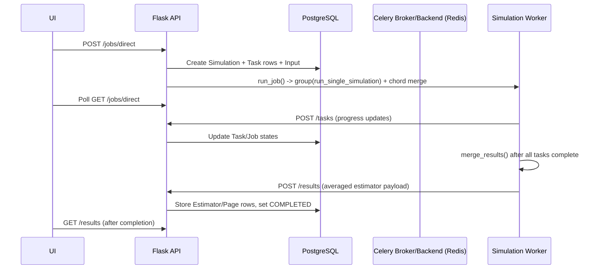
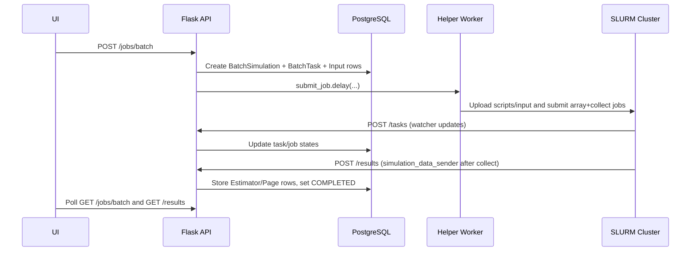

This document describes what the code does today for simulation orchestration.

It is based on direct inspection of the current implementations in:

- backend: https://github.com/yaptide/yaptide/tree/master/yaptide
- UI: https://github.com/yaptide/ui/tree/master/src
- existing docs for cross-checking: [System Overview](/for_developers/architecture/overview/) and [Data Flow](/for_developers/architecture/data-flow/)

## Scope

In-scope execution paths:

- Direct execution via Celery workers (`/jobs/direct`)
- Batch execution via SLURM over SSH (`/jobs/batch`)

Not in scope here:

- Geant4 local browser execution internals
- Future architecture proposals (covered by ADRs and design docs)

## Runtime Components

| Component                            | Current role                                                                   |
| ------------------------------------ | ------------------------------------------------------------------------------ |
| UI (`ui`)                            | Submits jobs, polls statuses, fetches final results                            |
| Flask API (`yaptide/application.py`) | Accepts submissions, validates update tokens, stores state/results             |
| Celery simulation worker             | Runs simulator tasks and merge task for direct jobs                            |
| Celery helper worker                 | Submits SLURM jobs and performs helper operations                              |
| Redis                                | Celery broker + result backend                                                 |
| PostgreSQL                           | Persistent storage for simulations, tasks, inputs, estimators, pages, logfiles |
| Remote cluster (SLURM)               | Executes array jobs and collect jobs for batch mode                            |

## Direct Path (Celery)

### Submission and orchestration

Current behavior in code:

1. UI submits to `/jobs/direct` (run type in `RemoteWorkerSimulationService`).
2. `JobsDirect.post` validates payload, clamps `ntasks`, creates:
   - `CelerySimulationModel`
   - `CeleryTaskModel` rows
   - `InputModel`
3. Backend creates per-task UUIDs and dispatches workflow through `run_job`:
   - `group(run_single_simulation.s(...).set(task_id=...))`
   - `chord(..., chain(set_merging_queued_state, merge_results))`
4. Merge task id is stored as `simulation.merge_id`.

Key files:

- `yaptide/routes/celery_routes.py`
- `yaptide/celery/utils/manage_tasks.py`

### Task execution and progress updates

Each `run_single_simulation` task:

1. Writes input files to a temporary working directory.
2. Runs simulator subprocess (`shieldhit` or `fluka`).
3. Starts monitor thread (`read_shieldhit_file` or `read_fluka_file`) to parse log progress.
4. Sends task updates to Flask `/tasks` with `simulation_id`, `task_id`, `update_key`, and `update_dict`.
5. Converts estimator objects to JSON-like dictionaries via `estimators_to_list`.

Key files:

- `yaptide/celery/tasks.py`
- `yaptide/celery/utils/pymc.py`
- `yaptide/celery/utils/requests.py`
- `yaptide/routes/task_routes.py`

### Merge and persistence

After all direct tasks complete, `merge_results`:

1. Sets job state to `MERGING_RUNNING`.
2. Averages per-task estimator pages in Python (`average_estimators`).
3. Sends merged payload to Flask `/results`.
4. `ResultsResource.post` upserts estimators/pages into DB and marks simulation `COMPLETED`.

Result retrieval path:

- UI fetches from `/results`.
- Backend serves from DB (`EstimatorModel` + `PageModel`), with optional estimator/page filtering.

Key files:

- `yaptide/celery/tasks.py`
- `yaptide/routes/common_sim_routes.py`
- `yaptide/persistence/models.py`

## Batch Path (SLURM)

### Submission and remote execution

`JobsBatch.post` enqueues `submit_job` on helper worker.

`submit_job` currently:

1. Opens SSH connection using user certificate/private key.
2. Creates remote working directory in `$SCRATCH/yaptide_runs/<timestamp>`.
3. Uploads zipped inputs, `watcher.py`, and `simulation_data_sender.py`.
4. Generates scripts from templates and runs `sbatch` for:
   - array job (N simulations)
   - collect job (merge/convert/send)
5. Posts `/jobs` updates with `array_id`, `collect_id`, and `job_dir`.

Key files:

- `yaptide/routes/batch_routes.py`
- `yaptide/batch/batch_methods.py`
- `yaptide/batch/shieldhit_string_templates.py`
- `yaptide/batch/fluka_string_templates.py`

### Batch progress and result delivery

- Per-task progress: `watcher.py` parses logs and POSTs `/tasks`.
- Final results: collect script runs `convertmc json --many` on output files and then posts `/results` using `simulation_data_sender.py`.

## Current State Model

Current states in `EntityState`:

- `UNKNOWN`
- `PENDING`
- `RUNNING`
- `MERGING_QUEUED`
- `MERGING_RUNNING`
- `CANCELED`
- `COMPLETED`
- `FAILED`

State transitions are distributed across:

- `/jobs/direct` and `/jobs/batch` submission handlers
- monitor updates through `/tasks`
- merge stage (`set_merging_queued_state`, `merge_results`)
- `/results` persistence handler

## Storage Model (Current)

Current persistence model in PostgreSQL:

- `Simulation` (+ `CelerySimulation` / `BatchSimulation`)
- `Task` (+ `CeleryTask` / `BatchTask`)
- `Input` (gzip-compressed JSON blob)
- `Estimator` (gzip-compressed metadata)
- `Page` (gzip-compressed page JSON)
- `Logfiles` (gzip-compressed JSON)

Compression/decompression is performed in model property getters/setters using JSON serialize + gzip.

## UI Behavior Today

Current UI orchestration behavior:

- Polls simulation statuses periodically (fast interval while active).
- Fetches full numerical results only when simulation state is `COMPLETED`.
- Uses `/results` and estimator/page filtering endpoints after completion.

Key files:

- `ui/src/services/RemoteWorkerSimulationService.ts`
- `ui/src/WrapperApp/components/Simulation/SimulationsGrid/SimulationsGridHelpers.ts`
- `ui/src/WrapperApp/components/Simulation/RecentSimulations.tsx`

## What This Means For Phase 1+

As-is architecture is functional and supports two production paths, but it combines control-plane and data-plane concerns tightly:

- state updates and large result payload transport both flow through the same backend APIs and Celery/Redis stack
- merge is centralized in one Python task
- numerical result delivery is effectively end-of-job, not true incremental partial-result streaming
