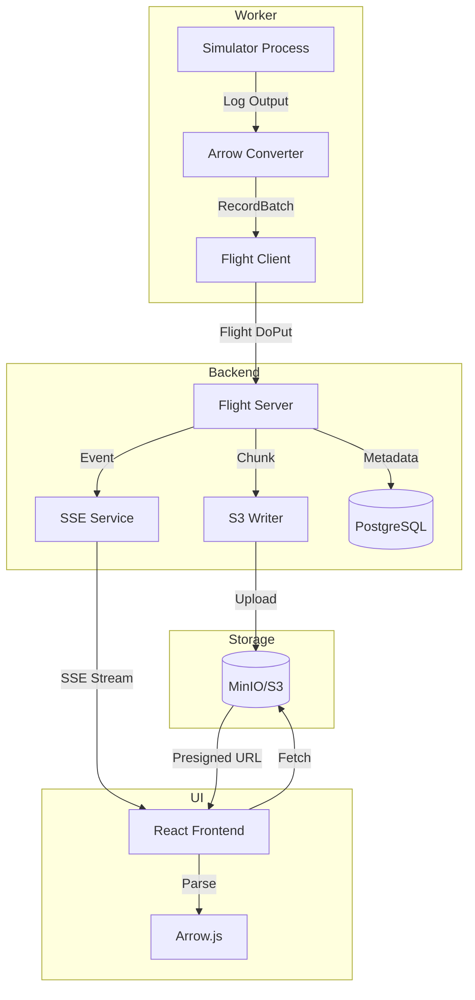

# Design: Partial Results Streaming

## Overview

This document describes how workers stream partial simulation results to S3 during execution, enabling UI visibility within ~30 seconds of job start.

## Architecture



## Components

### Worker-Side: Arrow Converter

```python
class SimulatorArrowConverter:
    def __init__(self, sim_type: str):
        self.sim_type = sim_type
    
    def parse_log_stream(self, log_path: Path) -> Iterator[pa.RecordBatch]:
        """
        Parse simulator output incrementally.
        Yield RecordBatches for each page as data becomes available.
        """
        ...
    
    def convert_estimator(self, estimator_path: Path, page_id: str) -> pa.RecordBatch:
        """
        Convert single estimator to Arrow.
        Schema: { bin_index: int32, value: float64, uncertainty: float64 }
        """
        ...
```

### Flight Protocol

**Descriptor Schema:**
```
FlightDescriptor.path = [
    "{job_id}",      # e.g., "550e8400-e29b-41d4-a716-446655440000"
    "{task_id}",     # e.g., "0", "1", "2"
    "{page_id}"      # e.g., "detector_dose_depth"
]

FlightDescriptor.metadata = {
    "schema_hash": "sha256-...",
    "compression": "zstd",
    "total_rows": "100000",
    "data_type": "float64"
}
```

### S3 Storage Layout

```
s3://yaptide-results/
├── {job_id}/
│   ├── metadata.json
│   └── {task_id}/
│       └── {page_id}/
│           ├── chunk_0001.arrow (ZSTD)
│           ├── chunk_0002.arrow
│           └── chunk_0003.arrow
```

## API Endpoints

### `GET /api/v2/jobs/{job_id}/chunks/{page_id}`

Returns presigned URL for chunk fetch.

**Response:**
```json
{
  "page_id": "dose_depth_001",
  "chunks": [
    {
      "url": "https://s3.../chunk_0001.arrow?X-Amz-...",
      "size_bytes": 245000,
      "row_count": 10000
    }
  ],
  "schema": { /* Arrow Schema JSON */ }
}
```

## SSE Event Schema

```typescript
interface PartialResultEvent {
  event: "partial_result";
  data: {
    job_id: string;
    task_id: number;
    page_id: string;
    chunk_url: string;
    chunk_bytes: number;
    schema_hash: string;
    is_final: boolean;
  };
}
```

## UI Integration

```typescript
// Connect to SSE stream
const eventSource = new EventSource(`/api/v2/events/${job_id}`);

eventSource.addEventListener('partial_result', (event) => {
  const data = JSON.parse(event.data);
  
  // Fetch chunk via presigned URL
  fetch(data.chunk_url)
    .then(res => res.arrayBuffer())
    .then(buffer => {
      // Parse Arrow IPC
      const reader = new FileReaderSync();
      const arrowTable = arrow.tableFromIPC(buffer);
      
      // Render with JSRoot
      renderHistogram(arrowTable, data.page_id);
    });
});
```

## Security

- Presigned URLs expire after 15 minutes
- Job ownership verified before URL generation
- S3 bucket policy restricts public access

## Performance Targets

| Metric | Target |
|--------|--------|
| Time-to-first-chunk | \<30 seconds |
| Chunk upload latency | \<5 seconds |
| UI render latency | \<2 seconds |
| S3 upload throughput | >100 MB/s |

## Related

- [ADR-001: S3 Storage](/rework-orchestration/adr/adr-001-s3-for-partial-results)
- [ADR-002: Arrow Format](/rework-orchestration/adr/adr-002-binary-format-selection)
- [ADR-007: SSE Notifications](/rework-orchestration/adr/adr-007-sse-notifications)

---

**Last updated:** 2026-04-30
