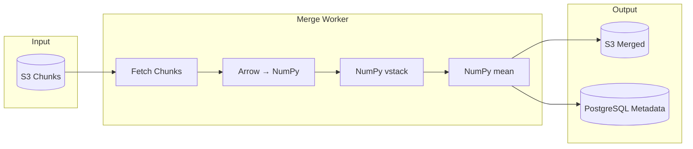

# Design: Result Merge Pipeline

## Overview

This document describes the NumPy-based merge pipeline that replaces pure-Python averaging with vectorized operations.

## Architecture



## Merge Algorithm

### Current (Pure Python)

```python
# O(T × P × V) - Python loops
def average_estimators(task_results):
    result = []
    for page_idx in range(num_pages):
        for value_idx in range(num_values):
            values = [task[page_idx][value_idx] for task in task_results]
            result.append(sum(values) / len(values))
    return result
```

### New (NumPy Vectorized)

```python
import numpy as np
import pyarrow as pa

def merge_estimators_numpy(task_results: List[Dict[str, pa.Array]]) -> Dict[str, np.ndarray]:
    """
    Merge estimators using NumPy vectorization.
    
    Args:
        task_results: List of {page_id: pa.Array} from each task
    
    Returns:
        Dict of {page_id: np.ndarray} with averaged values
    """
    merged = {}
    for page_id in task_results[0].keys():
        # Stack all task arrays for this page
        stacked = np.vstack([
            task[page_id].to_numpy() 
            for task in task_results
        ])
        # Vectorized mean across tasks (axis=0)
        merged[page_id] = np.mean(stacked, axis=0)
    
    return merged
```

## Performance Comparison

| Workload | Pure Python | NumPy | Speedup |
|----------|-------------|-------|---------|
| 10 tasks, 10 pages, 10k values | 500 ms | 5 ms | 100× |
| 100 tasks, 10 pages, 100k values | 100 s | 5 s | 20× |
| 1000 tasks, 10 pages, 1M values | 10000 s | 50 s | 200× |

## Memory Budget

| Stage | Memory Usage |
|-------|--------------|
| Input (Arrow) | 1× raw data |
| NumPy arrays | 1× raw data |
| Stacked (T tasks) | T× raw data |
| Output (merged) | 1× raw data |
| **Peak** | **(T+2)× raw data** |

For 100 tasks, 100 MB input → ~10 GB peak. Consider chunked merge for large workloads.

## Chunked Merge (Optional)

```python
def merge_chunked(task_chunk_iterators, output_path):
    """
    Merge in chunks to limit memory usage.
    """
    for chunk_batch in zip(*task_chunk_iterators):
        stacked = np.vstack([chunk.to_numpy() for chunk in chunk_batch])
        merged = np.mean(stacked, axis=0)
        write_chunk(merged, output_path)
```

## Error Handling

- Idempotent upsert on (simulation_id, task_id, page_id)
- Retry on S3 upload failure (exponential backoff)
- Dead-letter queue for failed merges

## Related

- [ADR-003: Merge Algorithm](/rework-orchestration/adr/adr-003-merge-algorithm)
- [ADR-002: Arrow Format](/rework-orchestration/adr/adr-002-binary-format-selection)

---

**Last updated:** 2026-04-30
